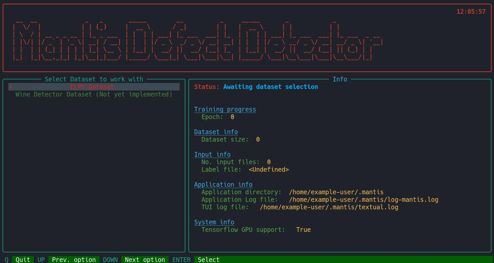

# Mantis Image Defect Classifier

Mantis learns to classify 2D images for defect detection.
Eventually, it should be able to handle other kinds of data
and be easily configurable with a simple schema definition
in a configuration file.

It is currently an early work in progress and is being tested on a [bencmark dataset](https://github.com/zae-bayern/elpv-dataset).
It will have a GUI, TUI and CLI, with only the TUI using 
 [Textual](https://github.com/Textualize/textual) being implemented currently.




# Installation

Currently no Pypy package is provided and 
cloning the repo is required.

Installing with pip on *NIX OS:
```
cd /desired/install/directory
git clone http://github.com/jbergen/mantis
# Optionally activate a virtual environment here 
pip install ./mantis
```

!TODO expand stub.

# Configuration
!TODO


# Examples
!TODO


Main steps involved in the development of a Machine Learning Algorithm are:

Import dataset (Input and Output)
          |
          \/
Pre-processing (Filtering, upsizing/downsizing)
          |
          \/
Build model or fit regressions to data
          |
          \/
Vizualize Results Graphically and 
compare with validation

## Part I - Wine Quality Predictor
Here we see a linear regression Machine Learning Algorithm applied to a generalized data for 
determining quality of wine based on different parameters such as alcohol content, density, pH, etc.
-
-
.
.
.

## Part II - Image Defect Predictor
Here, a machine learning algorithm which utilizes a Convolutional Neural Network is used to detect and classify 
defects on solar panels based on surface scratches on them.
-
-
.
.
.
